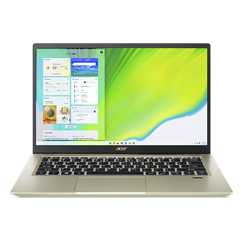
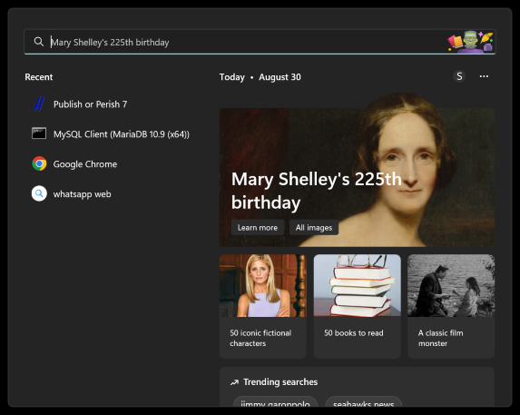
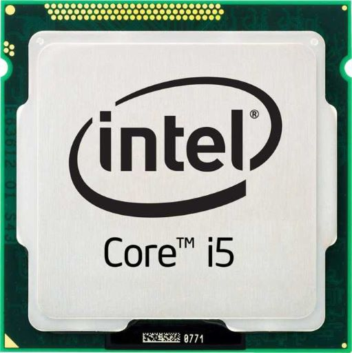
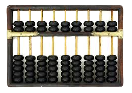
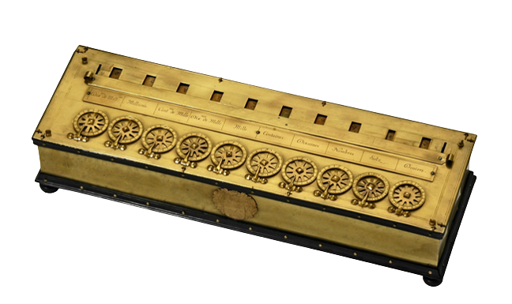
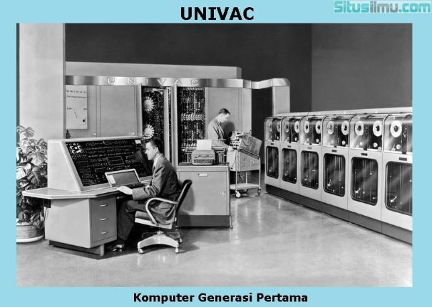
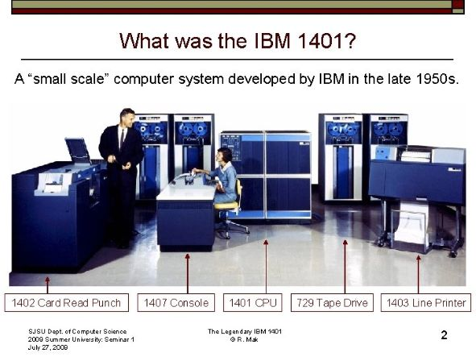
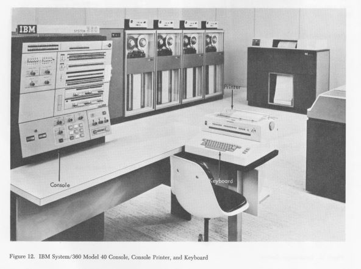
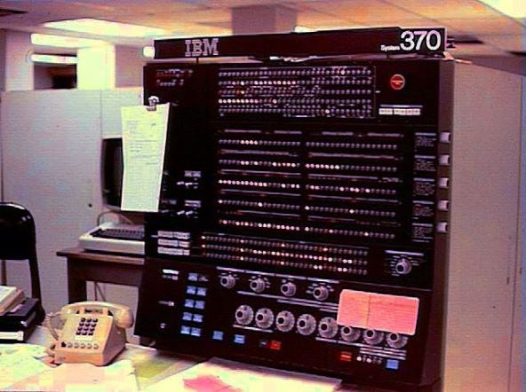

Difana Nanda Pridhasila Zein

2110131220017
# **Tugas Sistem Operasi**

## 1. Deskripsikan terkait benda-benda berikut yang ada PC/Laptop kalian, baik secara umum, spesifik, manfaat/kegunaan.
- PC/Laptop
- Sistem Operasi
- Prosesor
- Software
- Hardware
- Penyimpanan (Primer/Sekunder)

#### **A. Laptop Acer Swift 3x**
Laptop yang sedang saya gunakan sekarang adalah Acer Swift 3x yang diberikan oleh kedua orang tua saya pada masa PKKMB. Awalnya saya terkejut dan tidak menyangka bisa mendapatkan laptop baru, karena kedua orang tua saya tidak pernah ada pembicaraan untuk membeli laptop dan laptop yang sebelumnya pun masih dapat digunakan dengan baik.

#### **B. Sistem Operasi**
Pada saat pertama kali menggunakan laptop ini, sistem operasi yang digunakan adalah **Windows 10**. Namun, seiring berjalannya waktu saya memutuskan untuk memperbarui menjadi **Windows 11**.

Adapun perbedaan yang saya rasakan dalam menggunakan Windows 10 dan 11 ialah, tampilan antarmuka yang ada pada Windows 11 jauh lebih segar dan minimalis, khususnya pada bagian taskbar dan menu start. Selain itu, Windows 11 memiliki pilihan widget baru yang dapat membantu pengguna untuk mendapatkan informasi, cuaca, berita, foto dan lainnya secara sekilas.

#### **C. Prosesor**

Acer Swift 3x yang saya gunakan sekarang mempunyai prosesor __Intel Core i5__ yang dibekali juga dengan __Intel Iris Xe Max__. Selama menggunakan laptop ini, semua aplikasi yang digunakan dapat diakses dengan sangat baik dan lancar. Menurut saya, prosesor yang ada pada Laptop ini sangat mendukung dalam kegiatan perkuliahan saya sebagai mahasiswa Prodi Pendidikan Komputer. 

#### **D. Software**

- Zoom

Zoom adalah aplikasi komunikasi menggunakan video dan dapat digunakan dalam berbagai perangkat baik seluler maupun desktop. Software ini sangat membantu saya dalam mengikuti perkuliahan daring maupun kegiatan lainnya baik seminar ataupun kelas berbasis online.

- Office 365

Software ini mungkin menjadi salah satu yang terpenting bagi semua orang karena memang sangat diperlukan dalam aktivitas sehari-hari. Contohnya saja seperti word,excel, power point dan lainya. Kehidupan seorang mahasiswa tidak dapat dipisahkan dengan software tersebut dikarenakan tugas ataupun karya yang lainnya dibuat dengan menggunakan Office 365.

- Visual Studio Code

Software ini juga sama pentingnya seperti Office 365 terutama untuk anak IT seperti saya. Hampir semua kegiatan yang berhubungan dengan IT dilakukan menggunakan software ini. Ada banyak pilihan bahasa yang dapat digunakan dan ada banyak ekstensi yang diberikan guna membantu pengguna. Tidak hanya VSC saja editor yang saya gunakan dilaptop tetapi ada juga beberapa editor lainnya seperti Idle python, MariaDB dan NotePad.

3 Point diatas adalah contoh beberapa software yang sering saya gunakan tentunya, termasuk Chrome. Tetapi ada juga beberapa software yang pernah saya gunakan seperti Photoshop dan CorelDraw.

#### **E. Hardware**

| Acer Swift 3x | Intel Core i5-1135G7
| ----- | :--: |
 Display | 14" Full HD 1920 x 1080 Teknologi In-plane Switching (IPS)
Proccesor | Prosesor intel Core™ i5-1135G7 (Cache 8M, hingga 4,20 GHz, dengan IPU)
Memory | 8GB DDR4
Hard Drive |  512GB SSD
Graphics | Intel Iris Xe Max Graphics
Optical Drive | N/A
Operating System | Windows 10 Home + Office Home & Studet
Networking | IEEE 802.11 a/g/n/ac/ax + Bluetooth 5.0
Battery | 4-cell 48Wh up to 12 hours
Weight | 1.3Kg
Dimensions |  323 (W) x 218 (D) x 15.95 (H) mm

#### **F. Penyimpanan**
Acer Swift 3x sudah menggunakan media penyimpanan yang lebih baik daripada laptop saya yang sebelumnya, yaitu SSD dengan kecepatan transfer data lebih cepat dan ukuran komponen lebih ringkas.

SSD dengan kapasitas 512GB sebagai media penyimpanan utama akan sangat membantu dan menunjang pembelajaran saya sebagai mahasiswa PILKOM dan saya berharap laptop ini bisa bertahan dalam jangka waktu yang lumayan panjang. Dengan kapasitas 512 GB Insya Allah saya tidak akan mengalami kendala dalam hal penyimpanan hehehe.

## 2. Eksplorasi Sejarah Perkembangan Komputer 
Sejak dahulu kala, proses pengolahan data telah dilakukan oleh manusia. Manusia juga menemukan alat-alat mekanik dan elektronik untuk membantu manusia dalam penghitungan dan pengolahan data supaya bisa mendapatkan hasil lebih cepat. Komputer yang kita temui saat ini adalah suatu evolusi panjang dari penemuan-penemuan manusia sejah dahulu kala berupa alat mekanik maupun elektronik.  Saat ini komputer dan piranti pendukungnya telah masuk dalam setiap aspek kehidupan dan
pekerjaan. Komputer yang ada sekarang memiliki kemampuan yang lebih dari sekedar perhitungan
matematik biasa. 

Bagaimanapun juga alat pengolah data dari sejak jaman purba sampai saat ini bisa kita golongkan ke dalam 4 golongan besar.
1. Peralatan manual : yaitu peralatan pengolahan data yang sangat sederhana, dan faktor terpenting
dalam pemakaian alat adalah menggunakan tenaga tangan manusia
2. Peralatan Mekanik : yaitu peralatan yang sudah berbentuk mekanik yang digerakkan dengan
tangan secara manual
3. Peralatan Mekanik Elektronik : Peralatan mekanik yang digerakkan oleh secara otomatis oleh
motor elektronik
4. Peralatan Elektronik : Peralatan yang bekerjanya secara elektronik penuh

#### **Alat Hitung Tradisional dan Kalkulator Mekanik**
Abacus, yang muncul sekitar 5000 tahun yang lalu di Asia kecil dan masih digunakan di beberapa tempat hingga saat ini, dapat dianggap sebagai awal mula mesin komputasi. Alat ini memungkinkan penggunanya untuk melakukan perhitungan menggunakan biji-bijian geser 
yang diatur pada sebuh rak. Para pedagang di masa itu menggunakan abacus untuk menghitung 
transaksi perdagangan. Seiring dengan munculnya pensil dan kertas, terutama di Eropa, abacus 
kehilangan popularitasnya. 

Setelah hampir 12 abad, muncul penemuan lain dalam hal mesin komputasi. Pada tahun 1642, 
Blaise Pascal (1623-1662), yang pada waktu itu berumur 18 tahun, menemukan apa yang ia sebut 
sebagai kalkulator roda numerik (numerical wheel calculator) untuk membantu ayahnya melakukan perhitungan pajak. 

Kotak persegi kuningan ini yang dinamakan Pascaline, menggunakan delapan roda putar bergerigi untuk menjumlahkan bilangan hingga delapan digit. Alat ini merupakan alat penghitung bilangan berbasis sepuluh. Kelemahan alat ini adalah hanya terbatas untuk melakukan penjumlahan.

Tahun 1694, seorang matematikawan dan filsuf Jerman, Gottfred Wilhem von Leibniz (1646-1716) 
memperbaiki Pascaline dengan membuat mesin yang dapat mengalikan. Sama seperti pendahulunya, 
alat mekanik ini bekerja dengan menggunakan roda-roda gerigi. 

Dengan mempelajari catatan dan gambar-gambar yang dibuat oleh Pascal, Leibniz dapat 
menyempurnakan alatnya. Barulah pada tahun 1820, kalkulator mekanik mulai populer. Charles 
Xavier Thomas de Colmar menemukan mesin yang dapat melakukan empat fungsi aritmatik dasar. 
Kalkulator mekanik Colmar, arithometer, mempresentasikan pendekatan yang lebih praktis dalam 
kalkulasi karena alat tersebut dapat melakukan penjumlahan, pengurangan, perkalian, dan 
pembagian. Dengan kemampuannya, arithometer banyak dipergunakan hingga masa Perang Dunia I. 
Bersama-sama dengan Pascal dan Leibniz, Colmar membantu membangun era komputasi mekanikal. 

**1. Komputer Generasi Pertama**

Komputer yang digolongkan sebagai generasi pertama adalah komputer elektronik yang menggunakan konsep stored program yaitu bahwa setiap operasi komputer dikontrol oleh program yang disimpan didalam memori.

Komputer generasi pertama menggunakan tabung vakum untuk sirkuit dan drum magnetik untuk penyimpanan memori. Tabung vakum digunakan untuk memeperkuat sinyal dengan mengendalikan gerakan elektron di ruang evakuasi. Komputer generasi pertama sangatlah sulit untuk dioperasikan dan berbiaya sangat mahal. _UNIVAC dan ENIAC_ adalah contoh komputer generasi pertama yang digunakan badan sensus Amerika Serikat.

**Ciri-ciri:**

- Program dibuat dalam bahasa mesin.
- Menggunakan konsep storage program.
- Komponen yang digunakan adalah tabung hampa udara.
- Ukuran fisiknya besar, sehingga membutuhkan daya listrik yang besar.
- Dapat disimpan di magnetic tape dan magnetic disk.
- Contohnya komputer IBM 701 buatan tahun 1953 sebagai komputer komersial berukuran besar dan IBM 705 yang dibuat tahun 1959 untuk industri

Pada perkembangan berikutnya, komputer generasi pertamapun bermunculan dari berbagai perusahaan pengembang komputer seperti MARK II, MARK III, IBM 702, CRC, UNIVAC II, IBM 705, Datamatic 1000 yang dibuat oleh Honey Well Corp dan lain sebagainya.

**2. Komputer Generasi Kedua**

Pada tahun 1948, penemuan transistor sangat mempengaruhi perkembangan komputer. Transistor menggantikan tube vakum di televisi, radio, dan komputer. Akibatnya, ukuran mesin-mesin elektrik berkurang drastis. 
Transistor mulai digunakan di dalam komputer mulai pada tahun 1956. Penemuan lain yang berupa pengembangan memori inti-magnetik membantu pengembangan komputer generasi kedua yang lebih kecil, lebih cepat, lebih dapat diandalkan, dan lebih hemat energi dibanding para pendahulunya. 

Pada awal 1960-an, mulai bermunculan komputer generasi kedua yang sukses di bidang bisnis, di universitas, dan di pemerintahan. Komputer-komputer generasi kedua ini merupakan komputer yang 
sepenuhnya menggunakan transistor. Mereka juga memiliki komponen-komponen yang dapat diasosiasikan dengan komputer pada saat ini: printer, penyimpanan dalam disket, memory, sistem operasi, dan program.

Salah satu contoh penting komputer pada masa ini adalah *IBM 1401* yang diterima secaa luas di kalangan industri. Pada tahun 1965, hampir seluruh bisnis-bisnis besar menggunakan komputer generasi kedua untuk memproses informasi keuangan. 

**Ciri-ciri:**

- Kapasitas memori utama cukup besar.
- Komponen yang digunakan adalah transistor yang jauh lebih kecil dibandingkan tabung hampa udara.
- Menggunakan magnetic tape dan magnetic disk yang berbentuk removable disk.
- Mempunyai kemampuan proses real-time dan time sharing.
- Proses operasinya lebih cepat.
- Orientasinya pada aplikasi bisnis dan teknik.
- Contohnya komputer PDP-5 dan PDP-8 buatan tahun 1963 sebagai komputer mini komersial pertama. Selain itu ada pula komputer IBM 7070, IBM 1400, NCR 300, dan sebagainya.

Program yang tersimpan di dalam komputer dan bahasa pemrograman yang ada di dalamnya 
memberikan fleksibilitas kepada komputer. Fleksibilitas ini meningkatkan kinerja dengan harga yang pantas bagi penggunaan bisnis. Dengan konsep ini, komputer dapa tmencetak faktur pembelian konsumen dan kemudian menjalankan desain produk atau menghitung daftar gaji. Beberapa bahasa pemrograman mulai bermunculan pada saat itu. Bahasa pemrograman _Common Business-Oriented Language_ **(COBOL)** dan _Formula Translator_ **(FORTRAN)** mulai umum 
digunakan. Bahasa pemrograman ini menggantikan kode mesin yang rumit dengan kata-kata, 
kalimat, dan formula matematika yang lebih mudah dipahami oleh manusia. Hal ini memudahkan 
seseorang untuk memprogram dan mengatur komputer. Berbagai macam karir baru bermunculan 
(programmer, analyst, dan ahli sistem komputer). Industri piranti lunak juga mulai bermunculan dan berkembang pada masa komputer generasi kedua ini.

**3. Komputer Generasi Ketiga**

Komputer Generasi ketiga ditandai dengan munculnya sirkuit sirkuit mini, yang berbentuk hybrid integrated circuit. Pada sirkuit mini tersebut, transistor dan diode yang terpisah diletakkan dalam satu tempat. Beberapa ciri yang lain dari generasi ini adalah adanya integrasi antara perangkat keras dan perangkat lunak dan berorientasi ke komunikasi data dan penanganan lebih dari satu operasi secara serempak.

Pengembangan sirkuit terpadu adalah ciri khas dari generasi ketiga komputer. Bentuk transistor semakin diperkecil dan ditempatkan di chip silikon, yang dinamakan semikonduktor. Teknologi ini semakin mempercepat kinerja komputer. Selama periode ini, mouse dan keyboard mulai diperkenalkan, generasi ketiga juga sudah dilengkapi dengan sistem operasi.Karakteristik generasi ketiga mulai terlihat jelas ketika pada tahun 1964 IBM menciptakan sebuah komputer baru menggunakan IC yang disebut dengan _IBM S/360_. 

**Ciri-ciri:**

- Komponen yang dipakai adalah IV (Integrated Circuits) yang terdiri atas ratusan atau ribuan transistor berbentuk hybrid integrated circuits dan monolithic integrated circuits.
- Proses operasinya jauh lebih cepat dan lebih tepat, kapasitas memori komputer jauh lebih besar.
- Ukuran fisik jauh lebih kecil sehingga penggunaan listrik lebih hemat.
- Menggunakan magnetic disk yang sifatnya random access.
- Dapat melakukan multiprocessing dan multiprogramming.
- Alat input-output mengalami pengembangan dengan menggunakan visual display terminal.
- Dapat melakukan komunikasi data dari satu komputer dengan komputer lainnya.

**4. Komputer Generasi Keempat**

Komputer generasi keempat, dimulai sejak tahun 1970 dengan digunakannya **LSI** _(Large Scale Integration)_. LSI merupakan pemadatan beribu-ribu IC (Integrated Circuit) yang dijadikan satu dalam sebuah chip yaitu sebuah lempengan persegi empat yang memuat rangkaian-rangkaian terpadu didalamnya.

Di periode ini prosesor mikro mulai diperkenalkan, saat ribuan sirkuit terpadu dimasukan ke dalam sebuah silikon chip yang kecil. Prosesor pertama Intel, 404 chip mulai menjadi otak utama di sebuah komputer. saat periode inilah istilah Personal Computer (pc) mulai digunakan. Dengan teknologi yang lebih maju, generasi keempat menjadi tonggak awal pembangunan internet.

Komputer generasi keempat yang pertama adalah komputer yang diproduksi IBM Corporation dan diberi nama *IBM 370*. Kemudian pada masa itu juga mulai berkembang adanya jaringan komputer dengan konsep LAN (Local Area Network) yang dikenalkan pertama kali oleh Datapoint Corporation.

**Ciri-ciri:**
- Penggunaan LSI (Large Scale Integration) yang disebut juga sebagai Bipolar Large Scale Integration.
- Menggunakan mikroprosesor dan semikonduktor yang berbentuk chip untuk memori komputer.
- Contohnya, komputer IBM 370 menggunakan Intel 4004 mikroprosesor yang dikembangkan pertama kali pada tahun 1971 oleh perusahaan Intel Corporation dengan menggunakan chip mikroprosesor.
- Personal computer atau PC mulai berkembang sejak tahun 1977. Contohnya komputer Apple II dan komputer dekstop oleh Xerox Corporation.
- Pada tahun 1981, komputer mulai banyak menggunakan sistem Window dan mouse.

**5. Komputer Generasi Kelima**

Komputer generasi kelima merupakan komputer-komputer yang menggunakan ULSI sebagai mikroprosesornya. Komputer generasi ini dilahirkan pada tahun 1980, dan kehidupannya berlangsung hingga kini. Di samping itu, komputer ini juga memanfaatkan parallel processing dan Artificial Intelligence secara penuh.

Parallel processing atau pemrosesan secara paralel adalah kemampuan komputer dalam menyelesaikan banyak pekerjaan dalam waktu yang sesingkat mungkin. Hal ini disebabkan dari sejumlah mikroprosesor yang terpasang dalam internal komputer — mampu bekerja secara bersama-sama dan paralel.

Sedangkan Artificial Intelligence atau Kecerdasan Buatan merupakan salah satu komponen komputer yang mampu memudahkan berbagai pekerjaan komputer secara otomatis. Di mana proses memudahkan pekerjaan ini didapat dari pengalaman mesin dalam mengolah beragam input data sebelumnya menjadi segala sesuatu yang dapat membantu aktivitas manusia.

**Ciri-ciri:**
- Komponen yang dipakai adalah VLSI (Very Large Scale Integration).
- Kemampuan komputer dikembangakan untuk memecahkan masalah sendiri dengan bantuan AI (Artificial Intelligence). AI dapat diterapkan untuk mengoperasikan robot.
- Mulai dikembangkan komputer yang dapat menggantikan chip.
- Jepang adalah negara yang memelopori komputer generasi kelima.

