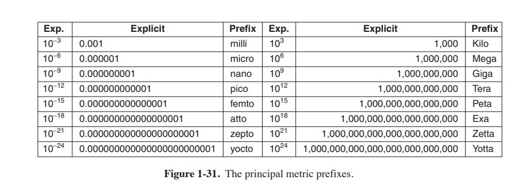

# **1.9 RESEARCH ON OPERATING SYSTEMS**

Computer science is a rapidly advancing field and it is hard to predict where it
is going. Researchers at universities and industrial research labs are constantly
thinking up new ideas, some of which go nowhere but some of which become the
cornerstone of future products and have massive impact on the industry and users.
Telling which is which turns out to be easier to do in hindsight than in real time.
Separating the wheat from the chaff is especially difficult because it often takes 20
to 30 years from idea to impact.

For example, when President Eisenhower set up the Dept. of Defense’s Advanced Research Projects Agency (ARPA) in 1958, he was trying to keep the
Army from killing the Navy and the Air Force over the Pentagon’s research budget. He was not trying to invent the Internet. But one of the things ARPA did was
fund some university research on the then-obscure concept of packet switching,
which led to the first experimental packet-switched network, the ARPANET. It
went live in 1969. Before long, other ARPA-funded research networks were connected to the ARPANET, and the Internet was born. The Internet was then happily
used by academic researchers for sending email to each other for 20 years. In the
early 1990s, Tim Berners-Lee invented the World Wide Web at the CERN research
lab in Geneva and Marc Andreesen wrote a graphical browser for it at the University of Illinois. All of a sudden the Internet was full of twittering teenagers. President Eisenhower is probably rolling over in his grave.

Research in operating systems has also led to dramatic changes in practical
systems. As we discussed earlier, the first commercial computer systems were all
batch systems, until M.I.T. inv ented general-purpose timesharing in the early
1960s. Computers were all text-based until Doug Engelbart invented the mouse
and the graphical user interface at Stanford Research Institute in the late 1960s.
Who knows what will come next?

In this section and in comparable sections throughout the book, we will take a
brief look at some of the research in operating systems that has taken place during 

INTRODUCTION

the past 5 to 10 years, just to give a flavor of what might be on the horizon. This
introduction is certainly not comprehensive. It is based largely on papers that have been published in the top research conferences because these ideas have at least
survived a rigorous peer review process in order to get published. Note that in computer science—in contrast to other scientific fields—most research is published in
conferences, not in journals. Most of the papers cited in the research sections were
published by either ACM, the IEEE Computer Society, or USENIX and are available over the Internet to (student) members of these organizations. For more information about these organizations and their digital libraries, see 

irtually all operating systems researchers realize that current operating systems are massive, inflexible, unreliable, insecure, and loaded with bugs, certain
ones more than others (names withheld here to protect the guilty). Consequently,
there is a lot of research on how to build better operating systems. Work has recently been published about bugs and debugging (Renzelmann et al., 2012; and Zhou et
al., 2012), crash recovery (Correia et al., 2012; Ma et al., 2013; Ongaro et al.,
2011; and Yeh and Cheng, 2012), energy management (Pathak et al., 2012; Petrucci and Loques, 2012; and Shen et al., 2013), file and storage systems (Elnably
and Wang, 2012; Nightingale et al., 2012; and Zhang et al., 2013a), high-performance I/O (De Bruijn et al., 2011; Li et al., 2013a; and Rizzo, 2012), hyperthreading and multithreading (Liu et al., 2011), live update (Giuffrida et al., 2013),
managing GPUs (Rossbach et al., 2011), memory management (Jantz et al., 2013;
and Jeong et al., 2013), multicore operating systems (Baumann et al., 2009; Kapritsos, 2012; Lachaize et al., 2012; and Wentzlaff et al., 2012), operating system correctness (Elphinstone et al., 2007; Yang et al., 2006; and Klein et al., 2009), operating system reliability (Hruby et al., 2012; Ryzhyk et al., 2009, 2011 and Zheng et al., 2012), privacy and security (Dunn et al., 2012; Giuffrida et al., 2012; Li et al.,
2013b; Lorch et al., 2013; Ortolani and Crispo, 2012; Slowinska et al., 2012; and
Ur et al., 2012), usage and performance monitoring (Harter et. al, 2012; and Ravindranath et al., 2012), and virtualization (Agesen et al., 2012; Ben-Yehuda et al.,
2010; Colp et al., 2011; Dai et al., 2013; Tarasov et al., 2013; and Williams et al.,
2012) among many other topics.

# **1.10 OUTLINE OF THE REST OF THIS BOOK** 

We hav e now completed our introduction and bird’s-eye view of the operating
system. It is time to get down to the details. As mentioned already, from the programmer’s point of view, the primary purpose of an operating system is to provide 

OUTLINE OF THE REST OF THIS BOOK

some key abstractions, the most important of which are processes and threads, address spaces, and files. Accordingly the next three chapters are devoted to these
critical topics.

Chapter 2 is about processes and threads. It discusses their properties and how
they communicate with one another. It also gives a number of detailed examples
of how interprocess communication works and how to avoid some of the pitfalls.

In Chap. 3 we will study address spaces and their adjunct, memory management, in detail. The important topic of virtual memory will be examined, along
with closely related concepts such as paging and segmentation.

Then, in Chap. 4, we come to the all-important topic of file systems. To a considerable extent, what the user sees is largely the file system. We will look at both
the file-system interface and the file-system implementation.

Input/Output is covered in Chap. 5. The concepts of device independence and device dependence will be looked at. Several important devices, including disks,
keyboards, and displays, will be used as examples.

Chapter 6 is about deadlocks. We briefly showed what deadlocks are in this
chapter, but there is much more to say. Ways to prevent or avoid them are discussed.

At this point we will have completed our study of the basic principles of single-CPU operating systems. However, there is more to say, especially about advanced topics. 
In Chap. 7, we examine virtualization. We discuss both the principles, and some of the existing virtualization solutions in detail. Since virtualization is heavily used in cloud computing, we will also gaze at existing clouds. Another advanced topic is multiprocessor systems, including multicores, parallel
computers, and distributed systems. These subjects are covered in Chap. 8.

A hugely important subject is operating system security, which is covered in
Chap 9. Among the topics discussed in this chapter are threats (e.g., viruses and
worms), protection mechanisms, and security models.

Next we have some case studies of real operating systems. These are UNIX,
Linux, and Android (Chap. 10), and Windows 8 (Chap. 11). The text concludes
with some wisdom and thoughts about operating system design in Chap. 12.

# **1.11 METRIC UNITS**

To avoid any confusion, it is worth stating explicitly that in this book, as in computer science in general, metric units are used instead of traditional English
units (the furlong-stone-fortnight system). The principal metric prefixes are listed in Fig. 1-31. The prefixes are typically abbreviated by their first letters, with the units greater than 1 capitalized. Thus a 1-TB database occupies 1012 bytes of storage and a 100-psec (or 100-ps) clock ticks every 10−10 seconds. Since milli and
micro both begin with the letter ‘‘m,’’ a choice had to be made. Normally, ‘‘m’’ is
for milli and ‘‘μ’’ (the Greek letter mu) is for micro.

INTRODUCTION

It is also worth pointing out that, in common industry practice, the units for measuring memory sizes have slightly different meanings. There kilo means 210
(1024) rather than 103 (1000) because memories are always a power of two. Thus a
1-KB memory contains 1024 bytes, not 1000 bytes. Similarly, a 1-MB memory contains 220 (1,048,576) bytes and a 1-GB memory contains 230 (1,073,741,824)
bytes. However, a 1-Kbps communication line transmits 1000 bits per second and a
10-Mbps LAN runs at 10,000,000 bits/sec because these speeds are not powers of
two. Unfortunately, many people tend to mix up these two systems, especially for
disk sizes. To avoid ambiguity, in this book, we will use the symbols KB, MB, and
GB for 210, 220, and 230 bytes respectively, and the symbols Kbps, Mbps, and Gbps
for 103, 106, and 109 bits/sec, respectively.

# **1.12 SUMMARY**

Operating systems can be viewed from two viewpoints: resource managers and
extended machines. In the resource-manager view, the operating system’s job is to
manage the different parts of the system efficiently. In the extended-machine view,
the job of the system is to provide the users with abstractions that are more convenient to use than the actual machine. These include processes, address spaces,
and files.

Operating systems have a long history, starting from the days when they replaced the operator, to modern multiprogramming systems. Highlights include
early batch systems, multiprogramming systems, and personal computer systems.

Since operating systems interact closely with the hardware, some knowledge of computer hardware is useful to understanding them. Computers are built up of
processors, memories, and I/O devices. These parts are connected by buses.

The basic concepts on which all operating systems are built are processes, memory management, I/O management, the file system, and security. Each of these
will be treated in a subsequent chapter.

SUMMARY

The heart of any operating system is the set of system calls that it can handle. These tell what the operating system really does. For UNIX, we have looked at four groups of system calls. The first group of system calls relates to process creation and termination. The second group is for reading and writing files. The third
group is for directory management. The fourth group contains miscellaneous calls.

Operating systems can be structured in several ways. The most common ones are as a monolithic system, a hierarchy of layers, microkernel, client-server, virtual
machine, or exokernel.